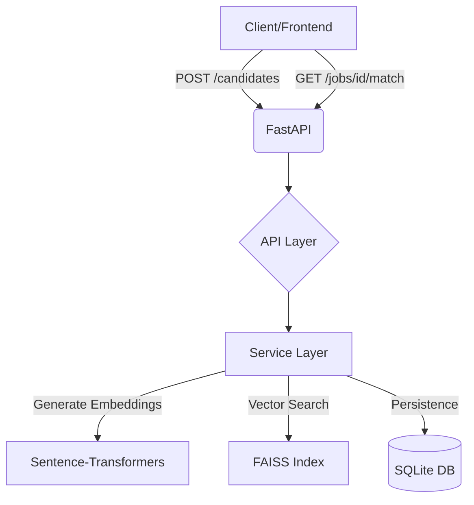

# 🤖 Semantic Candidate–Job Matching Engine

A high-performance Python backend that matches talent to jobs using **Deep Learning Embeddings** and **Vector Similarity Search**. This project moves beyond simple keyword Matching to understand the *meaning* and *context* of skills and job requirements.

---

## 🚀 1. Setup Instructions

Follow these steps to get the engine running on your local machine:

### Prerequisites
- Python 3.10 or higher
- `pip` (Python package manager)

### Installation
1. **Clone or Download** the project folder.
2. **Install Dependencies**:
   ```bash
   pip install -r requirements.txt
   ```

### Running the Server
From the project root directory, run:
```bash
python3 main.py
```
*The server will start at `http://127.0.0.1:8000`.*

### Running the Verification Script
To automatically register candidates and test matching across different industries:
```bash
python3 scripts/verify_matcher.py
```

---

## 🏛 2. Architecture Explanation

The project follows a modular **Tiered Architecture** to keep the code clean and maintainable.

### System Flow Diagram


### Project Structure
The code is organized into small, easy-to-read folders:
```text
.
├── main.py             # The engine's ignition! Start here.
├── app/
│   ├── api/            # Where our API links (URLs) are defined.
│   ├── services/       # The "Brain" - where AI and matching happens.
│   ├── db/             # Database setup (SQLite).
│   ├── models/         # What our data looks like in the database.
│   ├── schemas/        # Rules for what users can send us.
│   └── config.py       # General settings.
├── requirements.txt    # Fast-install for all tools I used.
└── scripts/
    └── verify_matcher.py # My automated test script.
```

### Folder Breakdown
- `main.py`: Entry point for the application.
- `app/api/`: Handles HTTP requests (Endpoints).
- `app/services/`: Contains the "Business Logic" (AI Matching & Embeddings).
- `app/models/`: Defines the Database Schema (SQLAlchemy).
- `app/schemas/`: Handles Data Validation (Pydantic).
- `app/db/`: Database connection and session management.

---

## 🧠 3. Embedding Model Used

We use the **`all-MiniLM-L6-v2`** model from the HuggingFace `sentence-transformers` library.

### Why this model?
- **Speed**: It is a "Mini" model, meaning it runs extremely fast on a standard CPU.
- **Efficiency**: It maps text to a **384-dimensional vector space**.
- **Accuracy**: It is specifically trained to understand sentence-level semantics, making it perfect for comparing short skill descriptions and job titles.

---

## 📏 4. Similarity Metric: Cosine Similarity

To determine how well a candidate matches a job, we calculate the **distance** between their vectors in the 384-dimensional space.

### The Math
We use **Cosine Similarity**, which measures the cosine of the angle between two vectors.
- **Score of 1.0**: The descriptions are identical in meaning.
- **Score of 0.0**: The descriptions are completely unrelated.

### Tie-Breaking Logic
If two candidates have similar skill scores, the engine applies a **Tie-Breaker**:
1. **Primary Sort**: Similarity Score (Higher is better).
2. **Secondary Sort**: Years of Experience (Higher is better).

---

## 💡 5. Concept & Approach

### The Problem
Traditional search finds "Nurse" but misses "Medical Staff." It finds "Python" but misses "Back-end Developer."

### Our Approach
1. **Vectorization**: We treat every resume and job description as a "point" in a high-dimensional universe.
2. **Persistence**: Unlike standard AI demos that lose data on restart, we store the **Embedded Vectors** inside a SQLite database as JSON.
3. **Re-hydration**: On every server startup, the engine reads the database and "warm-ups" the **FAISS Index** (Facebook AI Similarity Search) to ensure zero data loss.
4. **Ranking Pipeline**:
   - The job description is converted to a vector.
   - FAISS identifies the nearest candidate vectors.
   - Python logic pulls candidate details (like Experience) from SQL.
   - A final sorted list of the Top 5 matches is returned.

---

## 🛠 Tech Stack
- **FastAPI**: Modern, high-performance web framework.
- **SQLAlchemy**: SQL toolkit and Object Relational Mapper.
- **FAISS**: Facebook AI Similarity Search for efficient vector matching.
- **Sentence-Transformers**: State-of-the-art text embeddings.
- **SQLite**: Lightweight, file-based database.
